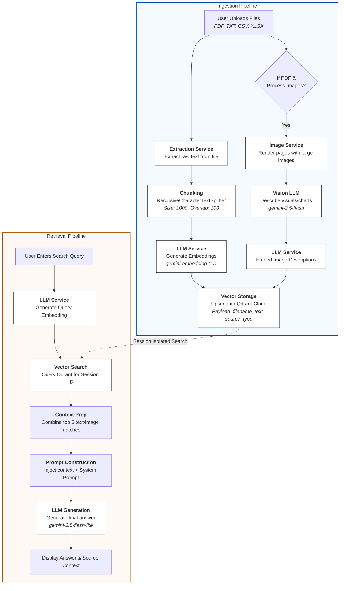

# 📄 Document Uploader & Semantic Search

Welcome! This application provides a high-performance, user-friendly interface for uploading documents, extracting their content, and performing powerful **Semantic Search** and **RAG** (Retrieval-Augmented Generation). 🚀

---

## ✨ Features at a Glance

- **Multi-Format Extraction**: Seamlessly process PDF, TXT, CSV, and XLSX files.
- **AI-Powered Vision**: Optionally describe and analyze images, charts, and graphs within PDFs.
- **Smart RAG**: Get direct answers to your questions based on retrieved document context.
- **Private Sessions**: Multi-tenant isolation ensures your data stays private and secure.
- **Optimized Performance**: Near-instant responsiveness thanks to smart caching and throttled background tasks.

---

## 🏗️ Architecture: RAG Pipeline


<details>
<summary>View Mermaid Source</summary>


</details>

---

## 🛠️ Setup Instructions

Follow these steps to get the app running on your local machine:

1. **Clone the repository:**
   ```bash
   git clone https://github.com/Nikhil-Maheshwari-10/Document-search.git
   cd Document-search
   ```

2. **Install dependencies using Poetry:**
   ```bash
   # Ensure you have Poetry installed first!
   poetry install
   ```

3. **Set up environment variables:**
   Create a `.env` file in the root directory with the following keys:
   ```env
   GEMINI_API_KEY=your_gemini_api_key
   EMBEDDING_MODEL="your_model_name"

   QDRANT_URL=your_qdrant_url
   QDRANT_API_KEY=your_qdrant_api_key

   EMBEDDING_DIM=your_embedding_dimension
   CHUNK_SIZE=your_chunk_size
   CHUNK_OVERLAP=your_chunk_overlap
   QDRANT_COLLECTION="your_collection_name"
   RAG_CONTEXT_SIZE=your_rag_context_size
   STORAGE_TIMEOUT_MINUTES=your_storage_timeout_minutes

   IMAGE_MODEL="your_model_name"
   RAG_MODEL="your_model_name"

   IMAGE_PROMPT="Your image prompt here..."
   RAG_SYSTEM_PROMPT="Your RAG system prompt here..."
   ```

4. **Run the app:**
   ```bash
   poetry run python main.py
   ```

---

## 💡 Usage Guide

### 📂 Upload Section
- **Multi-File Support**: Select and upload multiple documents at once.
- **Image Processing**: Check the toggle if you want the AI to analyze visual content (graphs/tables) within your PDFs.

### 🔍 Search Section
- **Natural Language Query**: Just type your question and hit **Search**.
- **Context Awareness**: Expand the "Show context" section to see the exact text and images the AI used to build your answer.

### ⚙️ Storage Status (Sidebar)
- **Live Countdown**: Keep track of your session with the countdown timer. 
- **Auto-Refresh**: Each search or upload resets your activity timer!
- **Note**: Data is automatically cleared after user inactivity is detected to keep storage clean.

### 🧹 Clear Storage
- **Instant Reset**: Click the **Clear Storage** button to immediately wipe your session data and reset the uploader for a fresh start.

---

## ☁️ Deployment

Ready to share? This app is fully optimized for **Streamlit Cloud**. Simply connect your GitHub repository, set `main.py` as the entry point, and add your `.env` keys to the **Secrets** manager in TOML format.

---

## 🛡️ License
This project is licensed under the MIT License.

**Enjoy fast, accurate, and intelligent document search!** ✨
